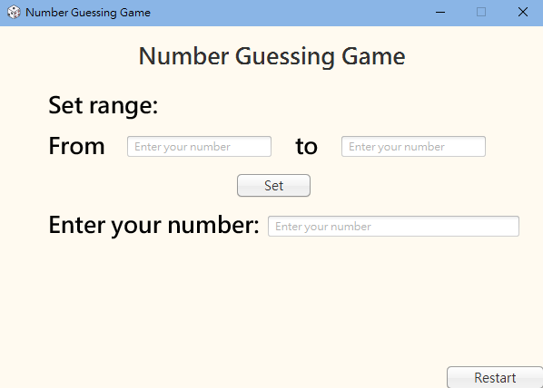
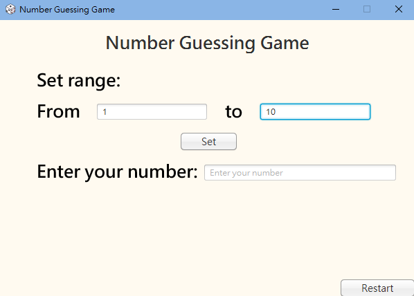
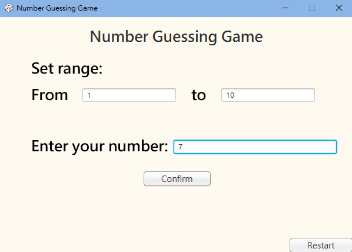
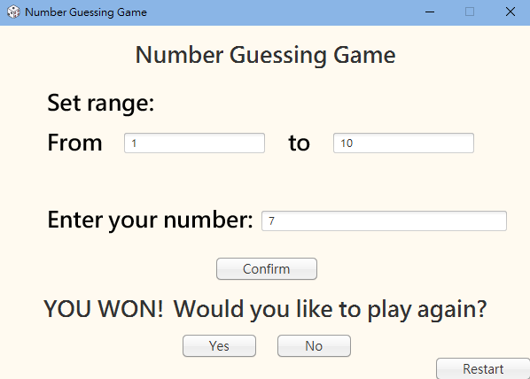
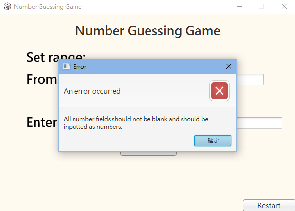
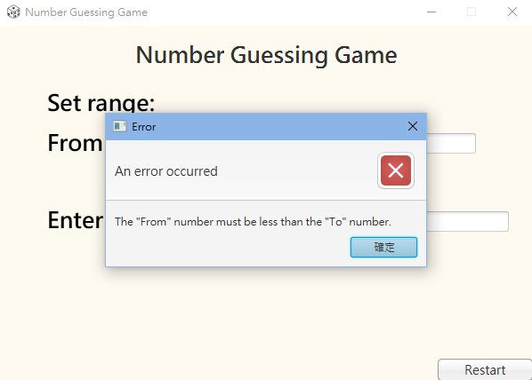

# Number-Guessing-Game 🎲

This project was my initial practice when I started learning JavaFX, created in April 2023.

This JavaFX application allows users to guess a randomly generated number within a specific range.

## Number Guessing Game Interface Demos 🖥

### Main Screen

### Setting Numbers

### Guessing Number

### Winning Screen

### Input Error Alert

### Range Error Alert

## Requirement 🔧

Ensure that you have Java, JavaFX, and Maven installed on your device.

## Features 🚀

- **Set Number Range**: Users can set a range of numbers for the guessing game.
- **Random Number Generation**: After setting a range, the game generates a random number for users to guess.
- **Number Guessing**: Users can input their guesses to try and match the generated number.
- **Prompts**: The game guides the user with alerts and messages, including error messages for invalid input range and success messages for correct guesses.
- **Restart Option**: Users can restart the game after a successful guess.

## Credit 🌟

[Dice icons created by bearicons - Flaticon](https://www.flaticon.com/free-icons/dice)
